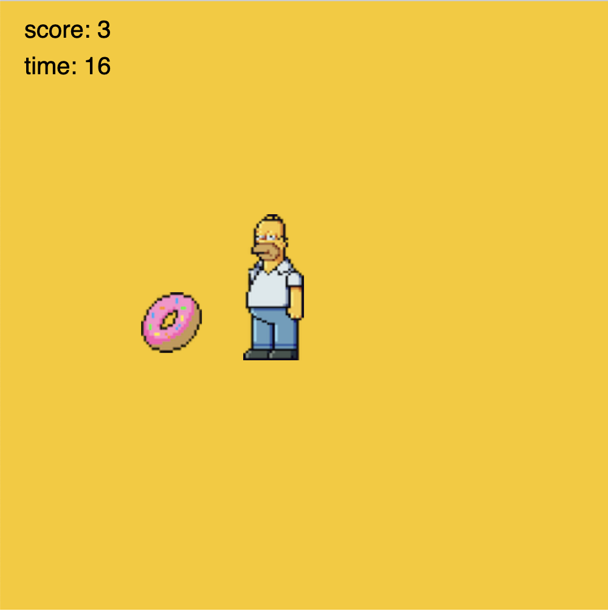

# Collect coins arcade video game

# Workshop description

This is a introductory JavaScript workshop based on[ p5js](https://p5js.org/). It was designed for teenagers aged 11-18 although it is suitable also for any adult who is learning JavaScript. The game is straightforward, it is about collecting as many items as possible in a fixed time (race against time type of game). Here is an example of Homer trying to collect Donuts: 



The project source code can be adapted for a variety of characters, for instance:

- homer > donuts
- mario > coins
- link > diamonds
- donkey > bananas
- sonic > rings


# Workshop structure

The workshop is divided in two sessions:

- session 1 : 4 hours. Introduction to creative coding using p5js. Learning outcomes:
    - discover the interface of the [online editor](https://editor.p5js.org/)
    - create accounts for students
    - getting familiar with concepts like variables, functions
    - understand the framework offered by p5js with the ```setup()``` and ```loop()``` functions
    - draw a circle, animate its size, animate its position with the mouse
- session 2 : 8 hours. Final project 
